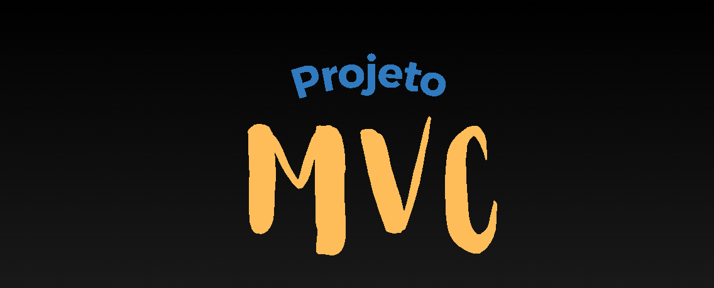

[](#)

Seja bem-vindo à documentação técnica do projeto MVC! Aqui você terá acesso a informações detalhadas sobre o projeto, as tecnologias empregadas e a arquitetura utilizada. Além disso, encontrará explicações sobre o modelo de esquemas de API e os testes de rotas implementados. Também fornecemos  um breve resumo sobre a arquitetura MVC que sustenta o projeto e, por fim,instruções claras para clonar o repositório . Esperamos que esta documentação seja útil e facilite a compreensão de todos os aspectos essenciais para o desenvolvimento e manutenção deste sistema.

## Visão Geral do Projeto

O projeto MVC é uma aplicação BackEnd em JavaScript, usando Node.js e a arquitetura MVC. Ele permite realizar operações CRUD para manipular dados do usuário no banco de dados. O objetivo é implementar um padrão de arquitetura organizado e trabalhar com tecnologias modernas e populares.

## Tecnologias Utilizadas

| Tecnologia | Função na aplicação                                                                                                                                  |
| ---------- | ---------------------------------------------------------------------------------------------------------------------------------------------------- |
| JavaScript | Linguagem de programação utilizada para escrever o código do back-end da aplicação.                                                                  |
| Node.js    | Ambiente de execução JavaScript assíncrono orientado a eventos, utilizado como base para a aplicação fornecendo bibliotecas.                         |
| Nodemon    | Ferramenta que monitora alterações nos arquivos do projeto e reinicia automaticamente o servidor durante o desenvolvimento.                          |
| Mongoose   | Biblioteca do Node.js que simplifica a interação com o MongoDB, um banco de dados NoSQL orientado a documentos.                                      |
| Express    | Framework web para Node.js que simplifica o desenvolvimento de aplicativos e APIs RESTful.                                                           |
| Chalk      | Pacote npm para formatação de texto no console, utilizado para melhorar a legibilidade dos logs e mensagens de saída no ambiente de desenvolvimento. |
| MongoDB    | Banco de dados NoSQL orientado a documentos, usado para armazenar os dados do projeto.                                                               |
| Postman    | Plataforma de testes de API, utilizada para testar e documentar as requisições e respostas do projeto.                                               |

## 📁 Arquitetura do Projeto

```
 📁mvc
   |
   |--📁node_modules
   |
   |--📁 src
   |  ||
   |  ||--📁 config
   |  |    |- 📄 dbConnect.js
   |  ||
   |  ||--📁 controllers
   |  |    |- 📄 apiController.js
   |  |
   |  ||--📁 models
   |  |    |- 📄 api.json
   |  |    |- 📄 apis.js
   |  |
   |  ||--📁 routes
   |  |    |- 📄 api.js
   |  |    |- 📄 index.js
   |  |
   |  ||-📄 app.js
   |  |
   |- 📄 .gitignore
   |- 📄 package-lock.json
   |- 📄 package.json
   |- 📄 README.md
   |- 📄 server.js


```

## Arquitetura MVC

O projeto segue a arquitetura Model-View-Controller (MVC), que divide a aplicação em três componentes principais:

1. **Model:** Responsável pela definição da estrutura de dados e regras de negócio.
2. **View:** Responsável pela interface de usuário e apresentação dos dados ao usuário final.
3. **Controller:** Responsável por receber as requisições do usuário, interagir com o Model e renderizar a View correspondente.

A utilização do padrão MVC permite uma separação clara de responsabilidades, facilitando a manutenção, reutilização de código e testabilidade do projeto.

## :memo: Esquema da API usando Mongoose (MongoDB)

```
const apiScheema = new mongoose.Schema({
  nome: { type: String, required: true },
  email: { type: String, required: true },
});
```
## :memo: Modelo de esquema para inserção de dados no banco de dados.

```
 {
    "nome": "Ingrid Maria Da Silva",
    "email": "ingridm@gmail.com"
  }
```

## :rocket: Testando Rotas

 <h3> Métodos e rotas Utilizados:</h3>

| Verbo  | EndPoint  | Descrição do Rota                                 |
| ------ | --------- | ------------------------------------------------- |
| GET    | /Usuários | Listar todos as Usuários cadastrados              |
| GET    | /:id      | Mostra o cadastro do Usuário por ID               |
| POST   | /         | Registra um novo Usuário                          |
| PUT    | /:id      | Altera dados do Usuário identificado pelo id      |
| DELETE | /:id      | Remove o cadastro do Usuário identificado pelo id |

## Testando as APIs

Para testar as APIs do projeto, você pode utilizar o Postman. Siga as etapas abaixo:

1. Abra o Postman.
2. Importe a coleção de requisições do projeto, localizada no diretório `postman` do repositório.
3. Após importar a coleção, você poderá enviar as requisições para testar as funcionalidades disponíveis.

## Clonando o Repositório

Para clonar o repositório do projeto, siga as etapas abaixo:

1. Abra o terminal e navegue até o diretório em que deseja armazenar o projeto.
2. Execute o seguinte comando para clonar o repositório:

```bash
git clone https://github.com/DelisG/mvc.git
```

Certifique-se de substituir `DelisG` pelo seu nome de usuário do GitHub.

## Executando o Projeto

Após clonar o repositório, siga as etapas abaixo para executar o projeto localmente:

1. Navegue até o diretório do projeto:

```bash
cd mvc
```

2. Instale as dependências do projeto:

```bash
npm install
```

3. Inicie o servidor local:

```bash
npm start
```

O servidor será iniciado e estará pronto para receber requisições.

## Contribuição

Se você deseja contribuir com este projeto, siga as etapas abaixo:

1. Faça um fork do repositório para o seu próp

usuário do GitHub. 2. Clone o repositório forkado para o seu ambiente de desenvolvimento local. 3. Crie uma branch para realizar suas alterações:

```bash
git checkout -b nome-da-sua-branch
```

4. Faça as alterações desejadas no código.
5. Commit suas alterações:

```bash
git commit -m "Descrição das alterações"
```

6. Envie suas alterações para o repositório remoto:

```bash
git push origin nome-da-sua-branch
```

7. Abra um pull request no repositório original, descrevendo suas alterações em detalhes.

<br>

_:sparkles: Obrigada a você que chegou até aqui! Espero que as informações aqui fornecidas tenham sido úteis e que você possa aproveitar ao máximo este projeto. Se você tiver alguma dúvida, problema ou sugestão, não hesite em entrar em contato comigo._

<<<<<<< HEAD
Esta documentação técnica fornece uma visão geral do projeto MVC, suas tecnologias, arquitetura, instruções para clonagem do repositório e informações sobre como testar as APIs. Fique à vontade para explorar o código-fonte e contribuir com o desenvolvimento do projeto. Se você tiver alguma dúvida adicional, consulte a documentação do código ou entre em contato comigo pelo email ***delisgmarques@gmail.com***.

#### :pink_heart: Obrigada a você que chegou até aqui :pink_heart:
=======
>>>>>>> 320c7ed662240c4c754e89b14fa3676ab1aae4cb
